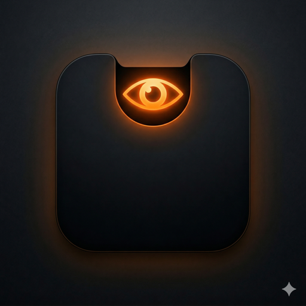

<div align="center">



# Argus

**Turn your MacBook notch into a real-time control panel for AI coding agents.**

A free, open-source alternative to [Vibe Island](https://github.com/nicepkg/vibe-island).

[Download](https://github.com/cnrture/Argus/releases) · [Homebrew](#installation) · [Report a bug](https://github.com/cnrture/Argus/issues)

</div>

---

Argus lives in the notch area of your Mac and gives you an ambient, always-visible view of what your AI coding agents are doing — so you can approve permissions, answer questions, and review plans without leaving your flow.

## Features

- **Notch UI** — Compact bar + expanded panel with Dynamic Island–style animations. Works on notched and non-notched Macs.
- **Multi-agent support** — Claude Code, Codex, Gemini CLI, Cursor, GitHub Copilot, OpenCode, CodeBuddy, Droid, Qoder, Factory.
- **Permission approvals** — Allow/Deny with diff preview. Keyboard shortcuts: `Cmd+Y` / `Cmd+N`.
- **Question answering** — Multiple choice + free-form text. Shortcuts: `Cmd+1` / `Cmd+2` / `Cmd+3`.
- **Plan review** — Markdown-rendered plans with approve/feedback flow.
- **Multi-session** — Watch several concurrent agent sessions at once.
- **Sound notifications** — 8-bit alerts with custom sound support. Smart suppression when you're already watching.
- **Window jumping** — Click a session to jump to the terminal/IDE window that owns it.
- **Fullscreen support** — 5pt hover trigger zone keeps Argus reachable even in fullscreen apps.
- **Launch at login** — Optional, via `LaunchAtLogin-Modern`.
- **Auto-updates** — Sparkle-based delta updates from a signed appcast.
- **Localization** — English, Turkish, Korean, Portuguese (BR), German, Spanish, French, Japanese, Simplified Chinese.
- **Privacy-first** — 100% local. No telemetry, no analytics. Your prompts and diffs never leave your machine.

## Installation

### Homebrew (recommended)

```bash
brew install --cask cnrture/tap/argus
```

### DMG

1. Download the latest DMG from the [Releases](https://github.com/cnrture/Argus/releases) page.
2. Drag `Argus.app` into your `Applications` folder.
3. On first launch, grant permission to install agent hooks.

### Requirements

- macOS 15.0 (Sequoia) or later
- Apple Silicon or Intel Mac

## Usage

1. Launch Argus. It has no dock icon and no menu bar item — it lives in the notch.
2. Hover the notch area to expand the panel.
3. Start a session in any supported agent (e.g. run `claude` in your terminal).
4. When the agent asks for permission or input, the notch expands and you can respond via click or keyboard shortcut.

### Keyboard shortcuts

| Shortcut | Action |
|---|---|
| `Cmd+Y` | Allow pending permission |
| `Cmd+N` | Deny pending permission |
| `Cmd+1` / `Cmd+2` / `Cmd+3` | Select question option 1/2/3 |

All shortcuts are configurable in Settings.

### Supported agents

| Agent | Events supported |
|---|---|
| Claude Code | Permissions, questions, plans, tool use, session lifecycle |
| Codex | Permissions, questions, session lifecycle |
| Gemini CLI | Permissions, questions, session lifecycle |
| Cursor | Tool use, session lifecycle |
| GitHub Copilot | Tool use, session lifecycle |
| OpenCode, CodeBuddy, Droid, Qoder, Factory | Varies per agent |

---

# For contributors

Everything below is for developers who want to build Argus from source, open a PR, or add a new agent integration.

## How it works

```
AI Agent Hook → argus-bridge (Swift CLI) → Unix Socket → Argus.app → Notch UI
```

When you install Argus, it registers hooks in each supported agent's config file. Those hooks invoke a small standalone CLI binary (`argus-bridge`) which reads JSON events from stdin and forwards them over a local Unix socket (`~/.argus/argus.sock`, mode `0600`) to the running Argus app.

- **Non-invasive hook merge** — Argus never overwrites your existing hooks. It merges its own entries into each agent's config and keeps a `.argus-backup` copy of the original file before the first modification.
- **Self-healing hooks** — Every 5 minutes, Argus verifies that its hooks are still present and repairs them if an agent update has stripped them out.
- **Zero external dependencies on the bridge** — `argus-bridge` is a pure Swift binary. It's safe to ship inside the app bundle and to invoke from any shell.
- **Blocking events stay open** — For permission requests, the socket connection stays open until you respond in the UI, so the agent actually waits for your decision.

## Building from source

### Prerequisites

- Xcode 16+ with the Swift 6 toolchain
- macOS 15.0 SDK

### Build

```bash
make build    # Debug build of Argus.app
make bridge   # Release build of the argus-bridge CLI only
make clean    # Remove build/ and release/
```

Or open `Argus/Argus.xcodeproj` in Xcode. Two schemes:

- `Argus` — the main menu-bar-less SwiftUI/AppKit app
- `argus-bridge` — the standalone CLI binary (embedded in the app bundle)

> Note: release artifacts (signed DMG, notarized ZIP, Sparkle appcast) are produced from the maintainer's machine with a Developer ID certificate and Sparkle private key. Contributors don't need any of that — `make build` is enough to develop and test.

## Project layout

```
Argus/
├── Argus/Argus.xcodeproj    # Xcode project (two schemes)
├── Argus/Argus/
│   ├── App/                 # AppDelegate, window controllers
│   ├── Core/                # Socket, Session, Hooks, Sound, Voice, Screen, Jump
│   ├── Models/              # HookEvent, Session, AgentSource, *Event
│   ├── UI/                  # SwiftUI views for the notch panel
│   └── Resources/           # Sounds, Pets, Localizable.strings (9 languages)
├── Casks/                   # Homebrew cask formula
├── scripts/                 # Release scripts (maintainer-only)
└── Makefile
```

## Dependencies (SPM)

- [KeyboardShortcuts](https://github.com/sindresorhus/KeyboardShortcuts) — Global keyboard shortcuts
- [LaunchAtLogin-Modern](https://github.com/sindresorhus/LaunchAtLogin-Modern) — Launch at login
- [Sparkle](https://sparkle-project.org) — Auto-updates

## Contributing

Contributions are welcome. Especially useful areas:

- **New agent integrations** — Add a case to `AgentSource` (`Argus/Argus/Models/AgentSource.swift`), define its config path, hook format (`.claude`, `.nested`, or `.flat`), and event mapping.
- **Localization** — Add a new `*.lproj` folder under `Argus/Argus/Resources/` with translated `Localizable.strings`.
- **Bug reports** — Please include your macOS version, the agent you were using, and a copy of `~/.argus/argus.log` if it exists.

### Before opening a PR

1. Run `make build` and confirm it succeeds.
2. Test against at least one real agent session.
3. Do not commit anything under `build/` or `release/`.
4. Keep PRs focused — one agent or one feature per PR, please.

## Troubleshooting

**Argus doesn't react when my agent runs.**
Open Argus Settings → Hooks, and click "Verify & Repair". Also confirm `~/.argus/argus.sock` exists while Argus is running.

**I see "hook installation failed".**
Argus needs write access to your agent's config directory (e.g. `~/.claude/`, `~/.codex/`). Make sure the directory exists and is owned by your user.

**Argus panel doesn't appear on my external display.**
The panel follows the focused screen. Move your cursor to the target display's notch area to trigger it.

**I want to remove Argus cleanly.**
Quit Argus, then delete `~/.argus/` and any `.argus-backup` files in your agent config directories. Argus also exposes "Uninstall Hooks" in Settings.

## License

MIT License — see [LICENSE](LICENSE) for details.
